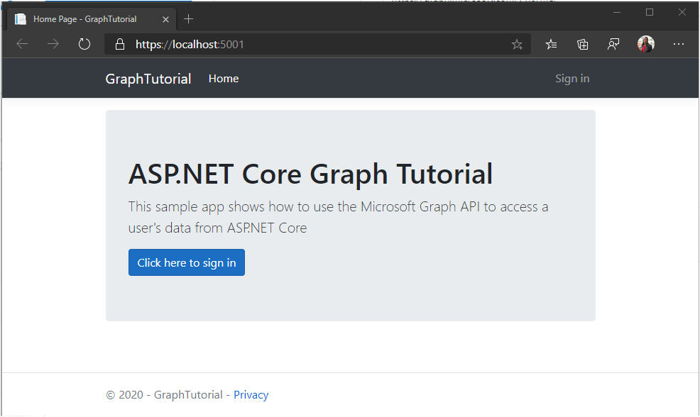

<!-- markdownlint-disable MD002 MD041 -->

Start by creating an ASP.NET Core web app.

1. Open your command-line interface (CLI) in a directory where you want to create the project. Run the following command.

    ```Shell
    dotnet new mvc -o GraphTutorial
    ```

1. Once the project is created, verify that it works by changing the current directory to the **GraphTutorial** directory and running the following command in your CLI.

    ```Shell
    dotnet run
    ```

1. Open your browser and browse to `https://localhost:5001`. If everything is working, you should see a default ASP.NET Core page.

> [!IMPORTANT]
> If you receive a warning that the certificate for **localhost** is un-trusted you can use the .NET Core CLI to install and trust the development certificate. See [Enforce HTTPS in ASP.NET Core](/aspnet/core/security/enforcing-ssl?view=aspnetcore-5.0) for instructions for specific operating systems.

## Add NuGet packages

Before moving on, install some additional NuGet packages that you will use later.

- [Microsoft.Identity.Web](https://www.nuget.org/packages/Microsoft.Identity.Web/) for requesting and managing access tokens.
- [Microsoft.Identity.Web.MicrosoftGraph](https://www.nuget.org/packages/Microsoft.Identity.Web.MicrosoftGraph/) for adding the Microsoft Graph SDK via dependency injection.
- [Microsoft.Identity.Web.UI](https://www.nuget.org/packages/Microsoft.Identity.Web.UI/) for sign-in and sign-out UI.
- [TimeZoneConverter](https://github.com/mj1856/TimeZoneConverter) for handling time zoned identifiers cross-platform.

1. Run the following commands in your CLI to install the dependencies.

    ```Shell
    dotnet add package Microsoft.Identity.Web --version 1.5.1
    dotnet add package Microsoft.Identity.Web.MicrosoftGraph --version 1.5.1
    dotnet add package Microsoft.Identity.Web.UI --version 1.5.1
    dotnet add package TimeZoneConverter
    ```

## Design the app

In this section you will create the basic UI structure of the application.

### Implement alert extension methods

In this section you will create extension methods for the `IActionResult` type returned by controller views. This extension will enable passing temporary error or success messages to the view.

> [!TIP]
> You can use any text editor to edit the source files for this tutorial. However, [Visual Studio Code](https://code.visualstudio.com/) provides additional features, such as debugging and Intellisense.

1. Create a new directory in the **GraphTutorial** directory named **Alerts**.

1. Create a new file named **WithAlertResult.cs** in the **./Alerts** directory and add the following code.

    :::code language="csharp" source="../demo/GraphTutorial/Alerts/WithAlertResult.cs" id="WithAlertResultSnippet":::

1. Create a new file named **AlertExtensions.cs** in the **./Alerts** directory and add the following code.

    :::code language="csharp" source="../demo/GraphTutorial/Alerts/AlertExtensions.cs" id="AlertExtensionsSnippet":::

### Implement user data extension methods

In this section you will create extension methods for the `ClaimsPrincipal` object generated by the Microsoft Identity platform. This will allow you to extend the existing user identity with data from Microsoft Graph.

> [!NOTE]
> This code is just a placeholder for now, you will complete it in a later section.

1. Create a new directory in the **GraphTutorial** directory named **Graph**.

1. Create a new file named **GraphClaimsPrincipalExtensions.cs** and add the following code.

    ```csharp
    using System.Security.Claims;

    namespace GraphTutorial
    {
        public static class GraphClaimTypes {
            public const string DisplayName ="graph_name";
            public const string Email = "graph_email";
            public const string Photo = "graph_photo";
            public const string TimeZone = "graph_timezone";
            public const string DateTimeFormat = "graph_datetimeformat";
        }

        // Helper methods to access Graph user data stored in
        // the claims principal
        public static class GraphClaimsPrincipalExtensions
        {
            public static string GetUserGraphDisplayName(this ClaimsPrincipal claimsPrincipal)
            {
                return "Adele Vance";
            }

            public static string GetUserGraphEmail(this ClaimsPrincipal claimsPrincipal)
            {
                return "adelev@contoso.com";
            }

            public static string GetUserGraphPhoto(this ClaimsPrincipal claimsPrincipal)
            {
                return "/img/no-profile-photo.png";
            }
        }
    }
    ```

### Create views

In this section you will implement the Razor views for the application.

1. Add a new file named **_LoginPartial.cshtml** in the **./Views/Shared** directory and add the following code.

    :::code language="cshtml" source="../demo/GraphTutorial/Views/Shared/_LoginPartial.cshtml" id="LoginPartialSnippet":::

1. Add a new file named **_AlertPartial.cshtml** in the **./Views/Shared** directory and add the following code.

    :::code language="cshtml" source="../demo/GraphTutorial/Views/Shared/_AlertPartial.cshtml" id="AlertPartialSnippet":::

1. Open the **./Views/Shared/_Layout.cshtml** file, and replace its entire contents with the following code to update the global layout of the app.

    :::code language="cshtml" source="../demo/GraphTutorial/Views/Shared/_Layout.cshtml" id="LayoutSnippet":::

1. Open **./wwwroot/css/site.css** and add the following code at the bottom of the file.

    :::code language="css" source="../demo/GraphTutorial/wwwroot/css/site.css" id="CssSnippet":::

1. Open the **./Views/Home/index.cshtml** file and replace its contents with the following.

    :::code language="cshtml" source="../demo/GraphTutorial/Views/Home/Index.cshtml" id="HomeIndexSnippet":::

1. Create a new directory in the **./wwwroot** directory named **img**. Add an image file of your choosing named **no-profile-photo.png** in this directory. This image will be used as the user's photo when the user has no photo in Microsoft Graph.

    > [!TIP]
    > You can download the image used in these screenshots from [GitHub](https://github.com/microsoftgraph/msgraph-training-aspnet-core/blob/master/demo/GraphTutorial/wwwroot/img/no-profile-photo.png).

1. Save all of your changes and restart the server (`dotnet run`). Now, the app should look very different.

    
