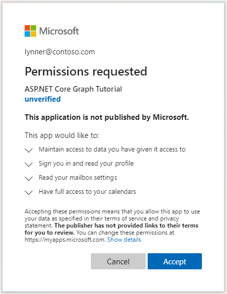
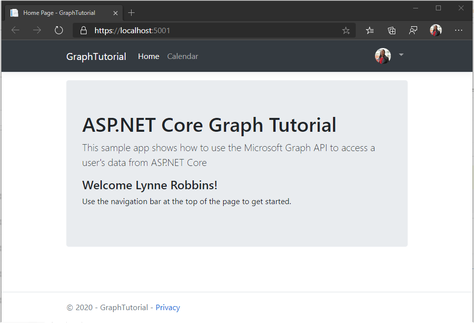
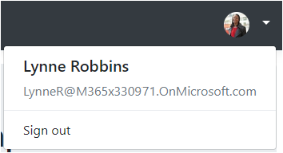

<!-- markdownlint-disable MD002 MD041 -->

In this exercise you will extend the application from the previous exercise to support authentication with Azure AD. This is required to obtain the necessary OAuth access token to call the Microsoft Graph API. In this step you will configure the [Microsoft.Identity.Web](https://www.nuget.org/packages/Microsoft.Identity.Web/) library.

> [!IMPORTANT]
> To avoid storing the application ID and secret in source, you will use the [.NET Secret Manager](/aspnet/core/security/app-secrets) to store these values. The Secret Manager is for development purposes only, production apps should use a trusted secret manager for storing secrets.

1. Open **./appsettings.json** and replace its contents with the following.

    :::code language="json" source="../demo/GraphTutorial/appsettings.json" highlight="2-6":::

1. Open your CLI in the directory where **GraphTutorial.csproj** is located, and run the following commands, substituting `YOUR_APP_ID` with your application ID from the Azure portal, and `YOUR_APP_SECRET` with your application secret.

    ```Shell
    dotnet user-secrets init
    dotnet user-secrets set "AzureAd:ClientId" "YOUR_APP_ID"
    dotnet user-secrets set "AzureAd:ClientSecret" "YOUR_APP_SECRET"
    ```

## Implement sign-in

Start by adding the Microsoft Identity platform services to the application.

1. Create a new file named **GraphConstants.cs** in the **./Graph** directory and add the following code.

    :::code language="csharp" source="../demo/GraphTutorial/Graph/GraphConstants.cs" id="GraphConstantsSnippet":::

1. Open the **./Startup.cs** file and add the following `using` statements to the top of the file.

    ```csharp
    using Microsoft.AspNetCore.Authentication.OpenIdConnect;
    using Microsoft.AspNetCore.Authorization;
    using Microsoft.AspNetCore.Mvc.Authorization;
    using Microsoft.Identity.Web;
    using Microsoft.Identity.Web.UI;
    using Microsoft.IdentityModel.Protocols.OpenIdConnect;
    using Microsoft.Graph;
    using System.Net;
    using System.Net.Http.Headers;
    ```

1. Replace the existing `ConfigureServices` function with the following.

    ```csharp
    public void ConfigureServices(IServiceCollection services)
    {
        services
            // Use OpenId authentication
            .AddAuthentication(OpenIdConnectDefaults.AuthenticationScheme)
            // Specify this is a web app and needs auth code flow
            .AddMicrosoftIdentityWebApp(Configuration)
            // Add ability to call web API (Graph)
            // and get access tokens
            .EnableTokenAcquisitionToCallDownstreamApi(options => {
                Configuration.Bind("AzureAd", options);
            }, GraphConstants.Scopes)
            // Use in-memory token cache
            // See https://github.com/AzureAD/microsoft-identity-web/wiki/token-cache-serialization
            .AddInMemoryTokenCaches();

        // Require authentication
        services.AddControllersWithViews(options =>
        {
            var policy = new AuthorizationPolicyBuilder()
                .RequireAuthenticatedUser()
                .Build();
            options.Filters.Add(new AuthorizeFilter(policy));
        })
        // Add the Microsoft Identity UI pages for signin/out
        .AddMicrosoftIdentityUI();
    }
    ```

1. In the `Configure` function, add the following line above the `app.UseAuthorization();` line.

    ```csharp
    app.UseAuthentication();
    ```

1. Open **./Controllers/HomeController.cs** and replace its contents with the following.

    ```csharp
    using GraphTutorial.Models;
    using Microsoft.AspNetCore.Authorization;
    using Microsoft.AspNetCore.Mvc;
    using Microsoft.Extensions.Logging;
    using Microsoft.Identity.Web;
    using System.Diagnostics;
    using System.Threading.Tasks;

    namespace GraphTutorial.Controllers
    {
        public class HomeController : Controller
        {
            ITokenAcquisition _tokenAcquisition;
            private readonly ILogger<HomeController> _logger;

            // Get the ITokenAcquisition interface via
            // dependency injection
            public HomeController(
                ITokenAcquisition tokenAcquisition,
                ILogger<HomeController> logger)
            {
                _tokenAcquisition = tokenAcquisition;
                _logger = logger;
            }

            public async Task<IActionResult> Index()
            {
                // TEMPORARY
                // Get the token and display it
                try
                {
                    string token = await _tokenAcquisition
                        .GetAccessTokenForUserAsync(GraphConstants.Scopes);
                    return View().WithInfo("Token acquired", token);
                }
                catch (MicrosoftIdentityWebChallengeUserException)
                {
                    return Challenge();
                }
            }

            public IActionResult Privacy()
            {
                return View();
            }

            [ResponseCache(Duration = 0, Location = ResponseCacheLocation.None, NoStore = true)]
            public IActionResult Error()
            {
                return View(new ErrorViewModel { RequestId = Activity.Current?.Id ?? HttpContext.TraceIdentifier });
            }

            [ResponseCache(Duration = 0, Location = ResponseCacheLocation.None, NoStore = true)]
            [AllowAnonymous]
            public IActionResult ErrorWithMessage(string message, string debug)
            {
                return View("Index").WithError(message, debug);
            }
        }
    }
    ```

1. Save your changes and start the project. Login with your Microsoft account.

1. Examine the consent prompt. The list of permissions correspond to list of permissions scopes configured in **./Graph/GraphConstants.cs**.

    - **Maintain access to data you have given it access to:** (`offline_access`) This permission is requested by MSAL in order to retrieve refresh tokens.
    - **Sign you in and read your profile:** (`User.Read`) This permission allows the app to get the logged-in user's profile and profile photo.
    - **Read your mailbox settings:** (`MailboxSettings.Read`) This permission allows the app to read the user's mailbox settings, including time zone and time format.
    - **Have full access to your calendars:** (`Calendars.ReadWrite`) This permission allows the app to read events on the user's calendar, add new events, and modify existing ones.

    

    For more information regarding consent, see [Understanding Azure AD application consent experiences](/azure/active-directory/develop/application-consent-experience).

1. Consent to the requested permissions. The browser redirects to the app, showing the token.

### Get user details

Once the user is logged in, you can get their information from Microsoft Graph.

1. Open **./Graph/GraphClaimsPrincipalExtensions.cs** and replace its entire contents with the following.

    :::code language="csharp" source="../demo/GraphTutorial/Graph/GraphClaimsPrincipalExtensions.cs" id="GraphClaimsExtensionsSnippet":::

1. Open **./Startup.cs** and replace the existing `.AddMicrosoftIdentityWebApp(Configuration)` line with the following code.

    :::code language="csharp" source="../demo/GraphTutorial/Startup.cs" id="AddSignInSnippet":::

    Consider what this code does.

    - It adds an event handler for the `OnTokenValidated` event.
        - It uses the `ITokenAcquisition` interface to get an access token.
        - It calls Microsoft Graph to get the user's profile and photo.
        - It adds the Graph information to the user's identity.

1. Add the following function call after the `EnableTokenAcquisitionToCallDownstreamApi` call and before the `AddInMemoryTokenCaches` call.

    :::code language="csharp" source="../demo/GraphTutorial/Startup.cs" id="AddGraphClientSnippet":::

    This will make an authenticated **GraphServiceClient** available to controllers via dependency injection.

1. Open **./Controllers/HomeController.cs** and replace the `Index` function with the following.

    ```csharp
    public IActionResult Index()
    {
        return View();
    }
    ```

1. Remove all references to `ITokenAcquisition` in the **HomeController** class.

1. Save your changes, start the app, and go through the sign-in process. You should end up back on the home page, but the UI should change to indicate that you are signed-in.

    

1. Click the user avatar in the top right corner to access the **Sign Out** link. Clicking **Sign Out** resets the session and returns you to the home page.

    

> [!TIP]
> If you do not see your user name on the home page and the use avatar dropdown is missing name and email after making these changes, sign out and sign back in.

## Storing and refreshing tokens

At this point your application has an access token, which is sent in the `Authorization` header of API calls. This is the token that allows the app to access Microsoft Graph on the user's behalf.

However, this token is short-lived. The token expires an hour after it is issued. This is where the refresh token becomes useful. The refresh token allows the app to request a new access token without requiring the user to sign in again.

Because the app is using the Microsoft.Identity.Web library, you do not have to implement any token storage or refresh logic.

The app uses the in-memory token cache, which is sufficient for apps that do not need to persist tokens when the app restarts. Production apps may instead use the [distributed cache options](https://github.com/AzureAD/microsoft-identity-web/wiki/token-cache-serialization) in the Microsoft.Identity.Web library.

The `GetAccessTokenForUserAsync` method handles token expiration and refresh for you. It first checks the cached token, and if it is not expired, it returns it. If it is expired, it uses the cached refresh token to obtain a new one.

The **GraphServiceClient** that controllers get via dependency injection will be pre-configured with an authentication provider that uses `GetAccessTokenForUserAsync` for you.
