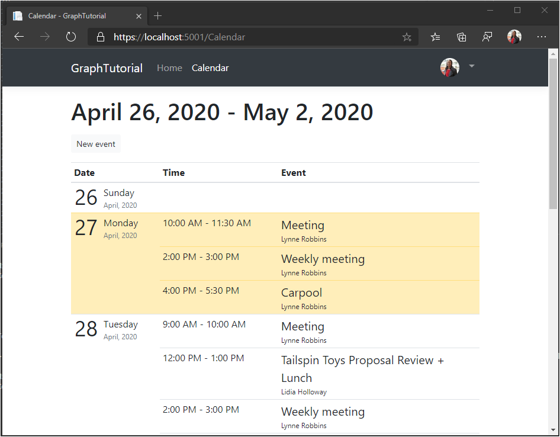

<!-- markdownlint-disable MD002 MD041 -->

In this section you will incorporate Microsoft Graph into the application. For this application, you will use the [Microsoft Graph Client Library for .NET](https://github.com/microsoftgraph/msgraph-sdk-dotnet) to make calls to Microsoft Graph.

## Get calendar events from Outlook

Start by creating a new controller for calendar views.

1. Add a new file named **CalendarController.cs** in the **./Controllers** directory and add the following code.

    ```csharp
    using GraphTutorial.Models;
    using Microsoft.AspNetCore.Mvc;
    using Microsoft.Extensions.Logging;
    using Microsoft.Identity.Web;
    using Microsoft.Graph;
    using System;
    using System.Collections.Generic;
    using System.Threading.Tasks;
    using TimeZoneConverter;

    namespace GraphTutorial.Controllers
    {
        public class CalendarController : Controller
        {
            private readonly GraphServiceClient _graphClient;
            private readonly ILogger<HomeController> _logger;

            public CalendarController(
                GraphServiceClient graphClient,
                ILogger<HomeController> logger)
            {
                _graphClient = graphClient;
                _logger = logger;
            }
        }
    }
    ```

1. Add the following functions to the `CalendarController` class to get the user's calendar view.

    :::code language="csharp" source="../demo/GraphTutorial/Controllers/CalendarController.cs" id="GetCalendarViewSnippet":::

    Consider what the code in `GetUserWeekCalendar` does.

    - It uses the user's time zone to get UTC start and end date/time values for the week.
    - It queries the user's [calendar view](/graph/api/calendar-list-calendarview?view=graph-rest-1.0) to get all events that fall between the start and end date/times. Using a calendar view instead of [listing events](/graph/api/user-list-events?view=graph-rest-1.0) expands recurring events, returning any occurrences that happen in the specified time window.
    - It uses the `Prefer: outlook.timezone` header to get results back in the user's timezone.
    - It uses `Select` to limit the fields that come back to just those used by the app.
    - It uses `OrderBy` to sort the results chronologically.
    - It uses a `PageIterator` to [page through the events collection](/graph/sdks/paging). This handles the case where the user has more events on their calendar than the requested page size.

1. Add the following function to the `CalendarController` class to implement a temporary view of the returned data.

    ```csharp
    // Minimum permission scope needed for this view
    [AuthorizeForScopes(Scopes = new[] { "Calendars.Read" })]
    public async Task<IActionResult> Index()
    {
        try
        {
            var userTimeZone = TZConvert.GetTimeZoneInfo(
                User.GetUserGraphTimeZone());
            var startOfWeek = CalendarController.GetUtcStartOfWeekInTimeZone(
                DateTime.Today, userTimeZone);

            var events = await GetUserWeekCalendar(startOfWeek);

            // Return a JSON dump of events
            return new ContentResult {
                Content = _graphClient.HttpProvider.Serializer.SerializeObject(events),
                ContentType = "application/json"
            };
        }
        catch (ServiceException ex)
        {
            if (ex.InnerException is MicrosoftIdentityWebChallengeUserException)
            {
                throw;
            }

            return new ContentResult {
                Content = $"Error getting calendar view: {ex.Message}",
                ContentType = "text/plain"
            };
        }
    }
    ```

1. Start the app, sign in, and click the **Calendar** link in the nav bar. If everything works, you should see a JSON dump of events on the user's calendar.

## Display the results

Now you can add a view to display the results in a more user-friendly manner.

### Create view models

1. Create a new file named **CalendarViewEvent.cs** in the **./Models** directory and add the following code.

    :::code language="csharp" source="../demo/GraphTutorial/Models/CalendarViewEvent.cs" id="CalendarViewEventSnippet":::

1. Create a new file named **DailyViewModel.cs** in the **./Models** directory and add the following code.

    :::code language="csharp" source="../demo/GraphTutorial/Models/DailyViewModel.cs" id="DailyViewModelSnippet":::

1. Create a new file named **CalendarViewModel.cs** in the **./Models** directory and add the following code.

    :::code language="csharp" source="../demo/GraphTutorial/Models/CalendarViewModel.cs" id="CalendarViewModelSnippet":::

### Create views

1. Create a new directory named **Calendar** in the **./Views** directory.

1. Create a new file named **_DailyEventsPartial.cshtml** in the **./Views/Calendar** directory and add the following code.

    :::code language="cshtml" source="../demo/GraphTutorial/Views/Calendar/_DailyEventsPartial.cshtml" id="DailyEventsPartialSnippet":::

1. Create a new file named **Index.cshtml** in the **./Views/Calendar** directory and add the following code.

    :::code language="cshtml" source="../demo/GraphTutorial/Views/Calendar/Index.cshtml" id="CalendarIndexSnippet":::

### Update calendar controller

1. Open **./Controllers/CalendarController.cs** and replace the existing `Index` function with the following.

    :::code language="csharp" source="../demo/GraphTutorial/Controllers/CalendarController.cs" id="IndexSnippet":::

1. Start the app, sign in, and click the **Calendar** link. The app should now render a table of events.

    
