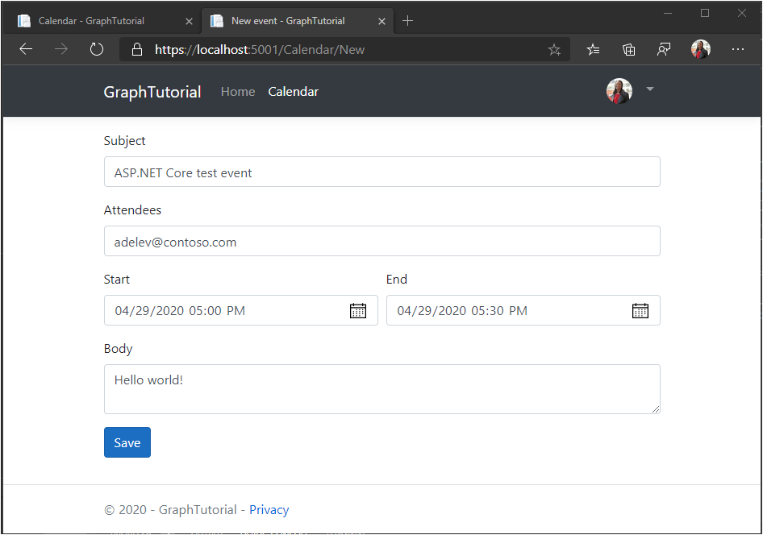

<!-- markdownlint-disable MD002 MD041 -->

In this section you will add the ability to create events on the user's calendar.

## Create model

1. Create a new file named **NewEvent.cs** in the **./Models** directory and add the following code.

    :::code language="csharp" source="../demo/GraphTutorial/Models/NewEvent.cs" id="NewEventSnippet":::

## Create view

1. Create a new file named **New.cshtml** in he **./Views/Calendar** directory and add the following code.

    :::code language="cshtml" source="../demo/GraphTutorial/Views/Calendar/New.cshtml" id="NewFormSnippet":::

## Add controller actions

1. Open **./Controllers/CalendarController.cs** and add the following action to the `CalendarController` class to render the new event form.

    :::code language="csharp" source="../demo/GraphTutorial/Controllers/CalendarController.cs" id="CalendarNewGetSnippet":::

1. Add the following action to the `CalendarController` class to receive the new event from the form when the user clicks **Save** and use Microsoft Graph to add the event to the user's calendar.

    :::code language="csharp" source="../demo/GraphTutorial/Controllers/CalendarController.cs" id="CalendarNewPostSnippet":::

1. Start the app, sign in, and click the **Calendar** link. Click the **New event** button, fill in the form, and click **Save**.

    
